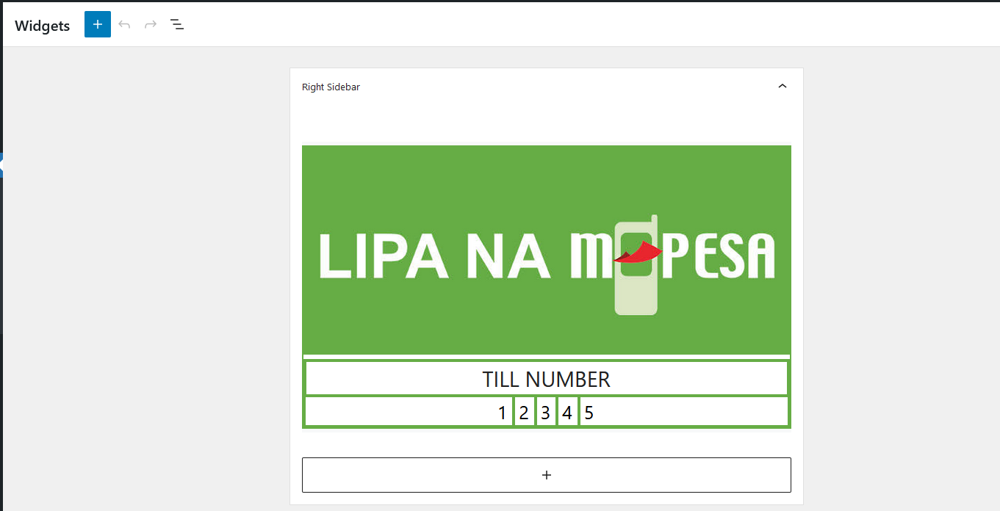

# Suppayments Till or Paybill Display Widget
A widget plugin for WordPress or WooCommerce that seamlessly displays the Suppayments Till or Paybill number on your website. Easily configure and showcase your payment details with this user-friendly solution. Display the Suppayments Till or Paybill number on your WordPress or WooCommerce website with ease using this widget plugin.

## Description

The Suppayments Till or Paybill Display Widget is a simple yet powerful WordPress plugin that allows you to showcase your Suppayments payment details effortlessly. Whether you're running a business or accepting donations, this plugin makes it convenient to display your Suppayments Till or Paybill number on your website.

## Features

- Easy setup and configuration
- Display your Suppayments Till or Paybill number on your website
- Seamless integration with WordPress and WooCommerce
- Customize the appearance of the widget to match your website's design
- User-friendly interface for managing widget settings

## Installation

1. Download the plugin ZIP file.
2. Log in to your WordPress admin panel.
3. Navigate to "Plugins" -> "Add New".
4. Click on the "Upload Plugin" button.
5. Choose the downloaded ZIP file and click "Install Now".
6. After installation, click on the "Activate" button to activate the plugin.
7. Go to the "Appearance" -> "Widgets" section to add and configure the Suppayments Till or Paybill Display Widget in your desired widget area.

## Configuration

1. In your WordPress admin panel, go to "Appearance" -> "Widgets".
2. Locate the "Suppayments Till or Paybill Display Widget" and drag it to your desired widget area.
3. Enter your Suppayments Till or Paybill number in the widget settings.
4. Customize the widget's appearance (if desired).
5. Save the settings.

## Frequently Asked Questions

**Q: Can I customize the appearance of the widget?**
A: Yes, the plugin provides options to customize the widget's appearance to match your website's design.

**Q: Can I use this plugin with WooCommerce?**
A: Absolutely! This plugin is fully compatible with WooCommerce, allowing you to display your Suppayments Till or Paybill number on your WooCommerce-powered online store.

## Documentation 
Discover the answers to your questions in our comprehensive Documentation and Knowledge Base. Start exploring now (https://docs.storemizer.com/product/suppayments-till-or-paybill-display-widget/)  

## Support

For any tech issues, bugs, questions, or feature requests, please [open an issue](https://github.com/Njengah/suppayments-display-widget/issues) on GitHub.

## Contributing

Contributions are welcome! If you have any enhancements, bug fixes, or new features to propose, please submit a pull request.

## License

This plugin is licensed under the [MIT License](https://opensource.org/licenses/MIT).
